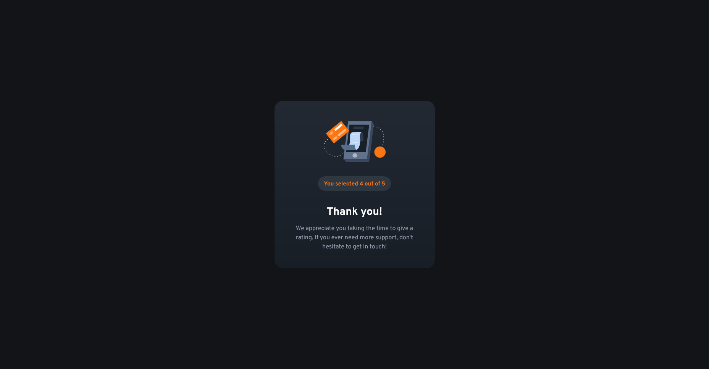
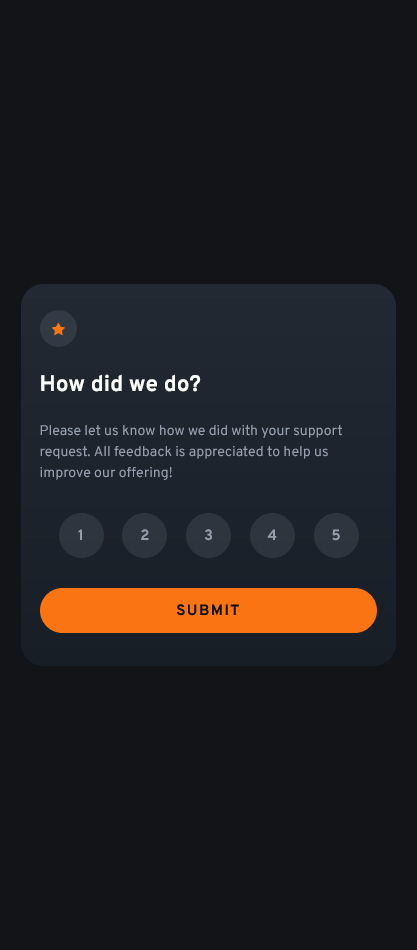

# Frontend Mentor - Interactive rating component solution

This is a solution to the [Interactive rating component challenge on Frontend Mentor](https://www.frontendmentor.io/challenges/interactive-rating-component-koxpeBUmI). Frontend Mentor challenges help you improve your coding skills by building realistic projects.

## Table of contents

- [Overview](#overview)
  - [The challenge](#the-challenge)
  - [Screenshot](#screenshot)
  - [Links](#links)
- [My process](#my-process)
  - [Built with](#built-with)
  - [What I learned](#what-i-learned)
- [Author](#author)

## Overview

### The challenge

Users should be able to:

- View the optimal layout for the app depending on their device's screen size
- See hover states for all interactive elements on the page
- Select and submit a number rating
- See the "Thank you" card state after submitting a rating

### Screenshot

### Links

- Solution URL: [https://github.com/Akiz-Ivanov/interactive-rating-component](https://github.com/Akiz-Ivanov/interactive-rating-component)
- Live Site URL: [https://akiz-ivanov.github.io/interactive-rating-component/](https://akiz-ivanov.github.io/interactive-rating-component/)

## My process

### Built with

- **React** – for component-based architecture
- **Tailwind CSS** – for utility-first styling
- **Flexbox** – for layout and responsive structure
- **Mobile-first workflow**

### What I learned

During this project, I focused on creating a smooth user experience for selecting a rating and providing dynamic content changes. I implemented a state-driven approach to switch between the rating form and the "thank-you" card after submission. Tailwind CSS helped streamline the responsive design, ensuring the layout adapted well across different screen sizes.

## Author

- Frontend Mentor - [@Akiz97](https://www.frontendmentor.io/profile/Akiz97)